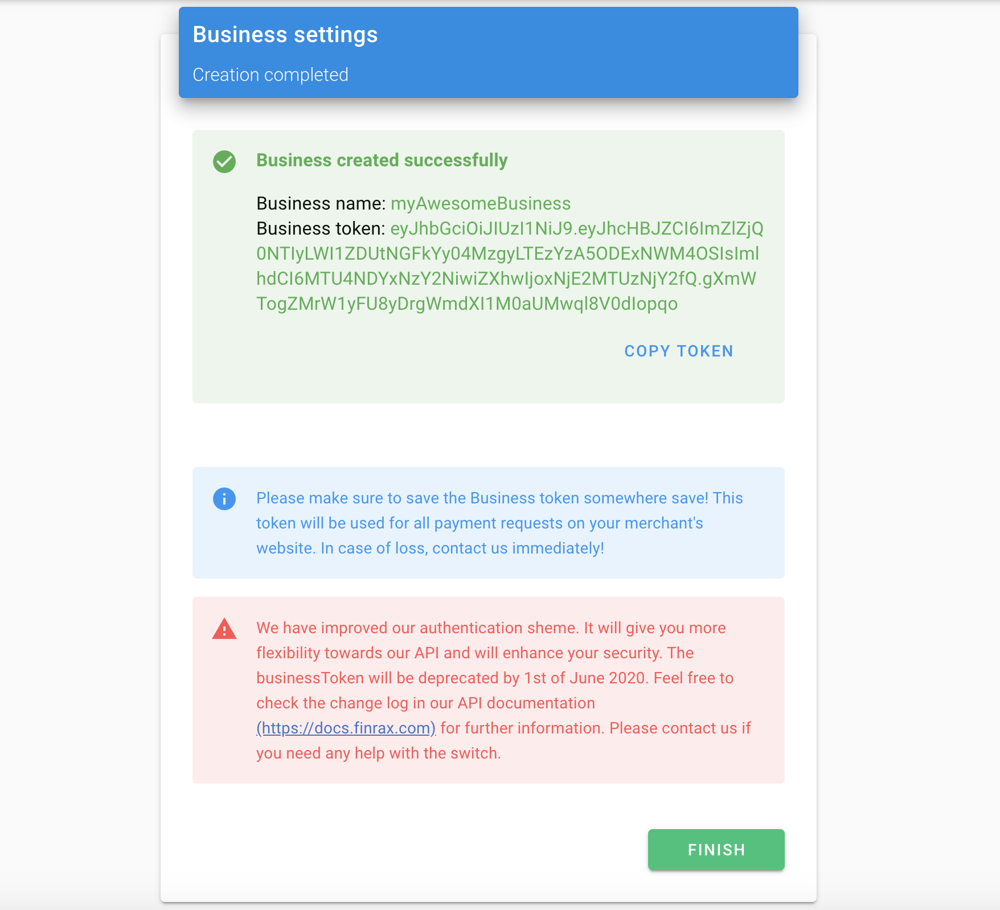

# Legacy

 👈Legacy version with businessToken 

For legacy integrators Finrax uses the **Authorization bearer** schema for request authentication. In order to start making requests to the API you must first create a business in the Finrax Dashboard. You'll be supplied with a **businessToken** in [JWT](https://jwt.io) standard.


**Finrax will continue to support the legacy authentication schema until 1st of June 2020.**



**Currently, authenticated endpoints supporting the legacy schema are:**

[**Initiate deposit request**](../references/payment-process/initiate-a-deposit-request.md)\*\*\*\*

\*\*\*\*[**Submit deposit data**](../references/payment-process/submit-deposit-data.md)\*\*\*\*

[**Initiate withdrawal request**](../references/payment-process/initiate-withdrawal-request.md)\*\*\*\*

\*\*\*\*[**Get deposit data**](../references/payment-process/get-deposit-data.md)\*\*\*\*

\*\*\*\*[**Get business by ID**](../references/business/get-business-by-id.md)


