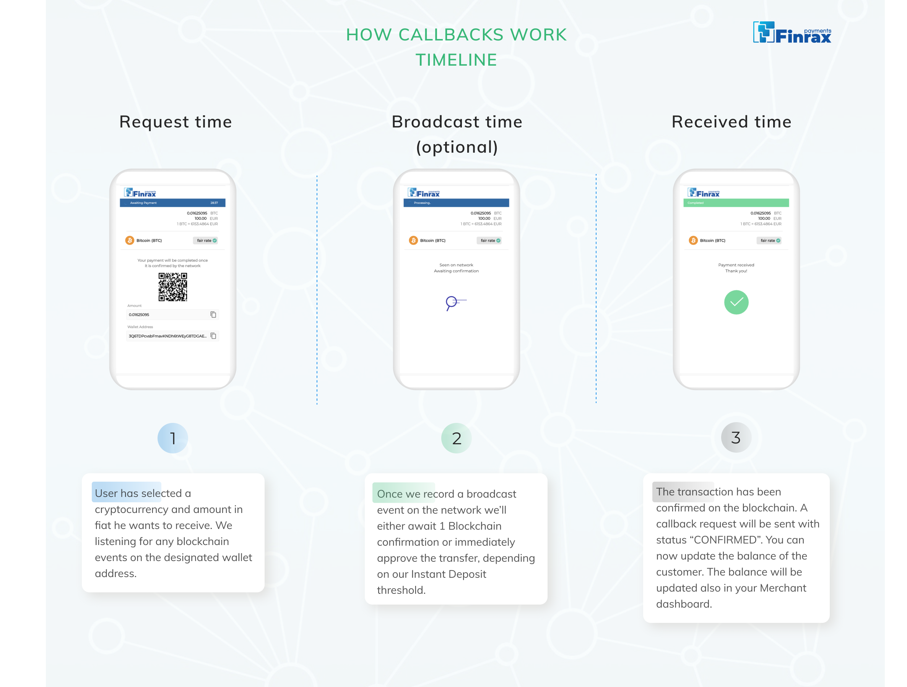

# Callbacks

Finrax sends 2 types of callback notifications on your predefined endpoints that you can set when creating [your business](https://blog.finrax.com/guides/how-to-create-a-business). This is a high-level overview of how and when you can use the callback notifications

* `depositReceivedCallbackUrl` Receives callback when the deposit has been seen \(broadcasted\) on the blockchain, or when the deposit has been confirmed on the blockchain.
* `withdrawalCallbackUrl` Receives a callback when a withdrawal transaction was successfully broadcasted on the blockchain


Handling callbacks plays a significant role for smooth service operations. The purpose is to allow easy, fast and automated reconciliation with your systems to properly assign Deposits and Withdrawals of your users.  



For coins which have longer processing time, we have [instant deposit](https://blog.finrax.com/guides/instant-deposits) functionality. notifications on `depositReceivedCallbackUrl` endpoint. This allows the merchant to credit the deposit of the user, while transfer is still _confirming_ on the blockchain. 


