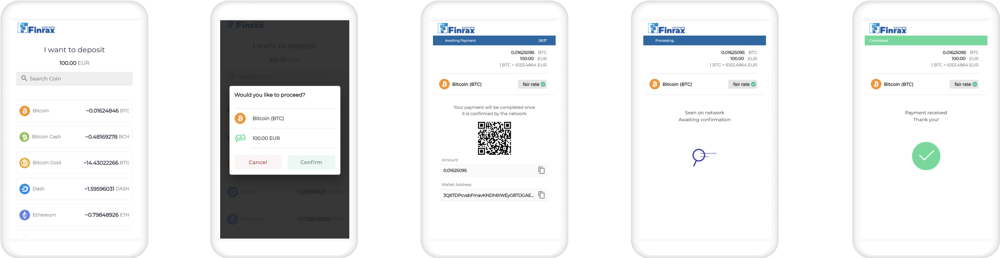

# Crypto payments

In this section we'll go through the endpoints you'll need to execute crypto payments on your website. You can make use of our hosted checkout experience or spin-off a custom UI.

### Payment statuses

| Status | Description |
| :--- | :--- |
| NEW | A payment has been created, however no depositCurrency has been selected yet. \(Screen 1 above\) |
| PENDING | Customer has selected a depositCurrency and is presented with a cryptocurrency deposit address. Finrax listens for blockchain events on the particular wallet address. |
| AWAITING | This is an optional status. It will be skipped if the deposit is eligible for [Instant Deposits](https://blog.finrax.com/guides/instant-deposits). This status represents that we've "seen" a transfer on the blockchain, but is still in UNCONFIRMED status. Transaction has not been validated yet on the blockchain \(Screen 4 above\) |
| DEPOSITED | The transaction has been completed and your account balance has been updated. A [callback notification](../callbacks/) is triggered to your designated endpoint. |
| EXPIRED | Once the expirationMinutes is reached and no deposit has been received against the supplied wallet address, the payment will be changed to status EXPIRED. Bear in mind that this is a tentative status. If we locate a blockchain transaction after the payment is changed to EXPIRED, we'll update the status from EXPIRED to DEPOSITED and trigger a callback notification. |
| BLOCKED | The transaction received against a given payment has been blocked due to compliance reasons. This usually happens if the origin of funds are marked as illicit \(i.e. Darknet, Scam etc.\) |

