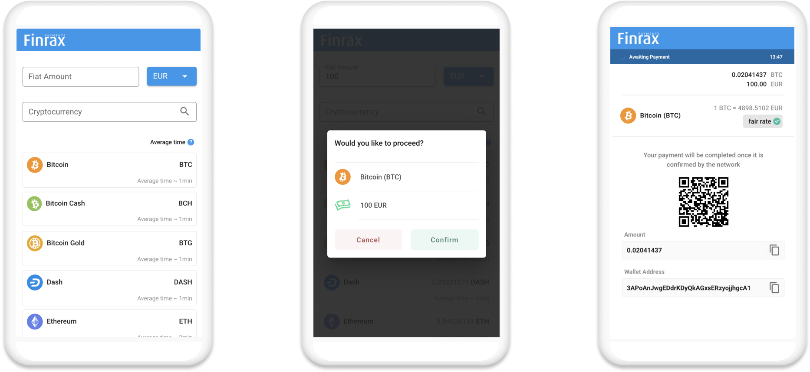

# 🔒 Add payment details





Submit deposit data



In case you'd like to spin off your own UI, this endpoint allows you to submit the details from the end-user for the initiated deposit request. The end-user will be required to choose a `depositCurrency` i.e. the cryptocurrency they want to deposit in. Once the request is submitted, the end-user will be supplied with a `walletAddress` and the `expectedDepositAmount` calculated using the most recent exchange rate.






Unique payment identifier provided as a response of POST `/payments`





Cryptocurrency that should be used for the deposit



Fiat currency code, if not supplied in POST `/payments` 



Amount in display currency the user wants to deposit, if not supplied in POST`/payments` 







Payment data submitted successfully


```javascript
{
    "paymentInfo": {
        "paymentRequestedAt": 1615388962,
        "actualDepositAmount": "0",
        "redirectUrl": "https://exampleurl.com/redirect/payment",
        "depositCurrency": "BTC",
        "actualDisplayAmount": "0",
        "expirationMinutes": 30,
        "paymentId": "35e24bc2-e2f4-42cd-9d59-1caa8a2b8c03",
        "expectedUniformAmount": "50.00",
        "expectedDepositAmount": "0.00106077",
        "walletAddress": "3ACv7yzCTQR779gKCMycbTUb3yMyBSomqo",
        "processorType": "BLOCKCHAIN",
        "displayCurrency": "EUR",
        "actualUniformAmount": "0",
        "locale": "en-US",
        "businessId": "19dee3c4-4dc9-4bcc-b8ed-92e3d4f256bd",
        "deposits": [],
        "rateType": "FLOATING",
        "status": "PENDING",
        "expectedDisplayAmount": "50.00",
        "destinationTag": null,
        "ltc3Address": null,
        "type": "ONE_TIME",
        "paymentInitiatedAt": 1615388890,
        "clientPaymentId": "fl22s001213021008wc0203"
    }
}
```





### Response schema

| Parameter | Type | Description |
| :--- | :--- | :--- |
| paymentInfo | object | Contains all payment relevant data |
| actualDepositAmount | string | Actual amount deposited in cryptocurrency  |
| actualDisplayAmount | string | Actual amount deposited in display currency |
| businessId | string | Unique business identifier `UUID` |
| clientPaymentId | string | Unique payment identifier provided in the request body of POST `/payments` |
| depositCurrency | string | The selected cryptocurrency for this payment |
| deposits | array | Array with all transactions for this payment |
| displayCurrency | string | The fiat currency chosen for display purposes |
| expectedDepositAmount | string | Amount in cryptocurrency to be deposited to fulfill the required amount in `displayCurrency` |
| expectedDisplayAmount | string | Amount in `displayCurrency` requested for this payment |
| expirationMinutes | number | Timeframe in which the deposit should succeed |
| locale | string | Language localisation abbreviation  |
| paymentId | string | Unique Finrax payment identifier `UUID` |
| paymentInitiatedAt | number | Timestamp when the payment was initiated `UNIX` |
| paymentRequestedAt | number | Timestamp when the payment was requested `UNIX` |
| status | string | Defines the status of the payment |
| walletAddress | string | Unique wallet address generated by Finrax for this payment where the cryptocurrency amount should be deposited |


