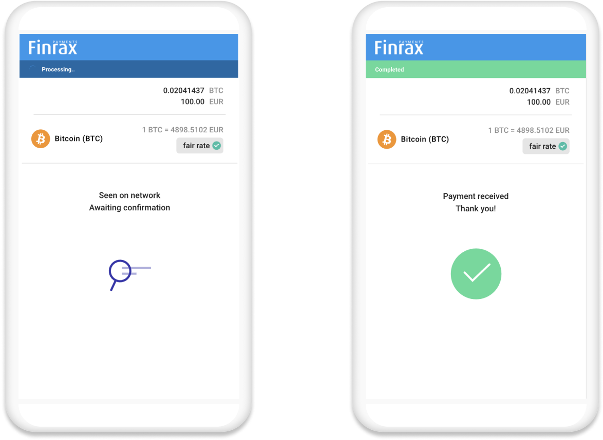

# Change deposit status 🔒





Change payment status



This endpoint allows you to change the status of a payment request. Works well if you are using our UI and you would like to update the payment page. We suggest using it together with the callback notification at **`Deposit broadcast time`**If you want to approve deposits while still in `UNCONFIRMED` status, you can also use this endpoint to change the status to `PROCESSED` so we can update the UI from "Awaiting" to "Confirmed".






Unique Finrax payment ID





Could be `PROCESSED`







Payment status changed successfully


```javascript
{
  "paymentId": "6d2a9979-ca29-46a5-a1c4-9dbf74e58000",
  "status": "PROCESSED"
}
```







### What will happen if I don't change the status?

It's not a critical resource. The idea is simple - If you are using our checkout page there's no way for us to know if you are crediting your end-users on`UNCONFIRMED` or `CONFIRMED` callback notification. In other words, we'll display to the user that we are awaiting blockchain confirmation, unless we are told otherwise by **you.**

* If you are going to use the callback notification with `UNCONFIRMED` status you might want to update the status.
* If you are using the callback notification with `CONFIRMED` status, then you can skip this request.


\*\*\*\*

